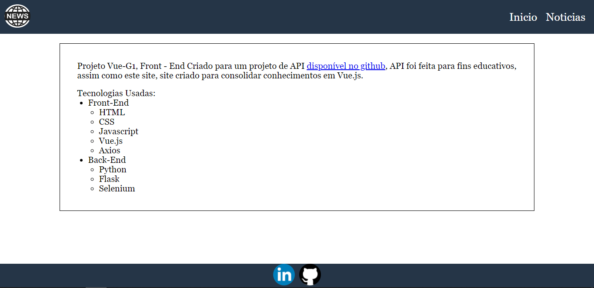
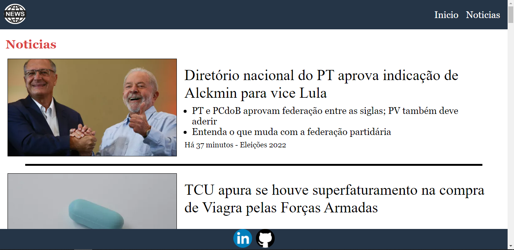

# Site de Lembretes
[](https://github.com/Kaue-Silva/Vue-G1/blob/master/LICENSE)

## Sobre o Projeto

Projeto e basicamente um Front para a o projeto API-G1, 
tambem serve para consolidar meus conhecimentos com Vue.js.

## Informações sobre o projeto
Projeto consome uma API que faz uma raspagem de dados do site G1 Notcias,
lembrando que o projeto foi feito para fins educativos.

## Layout

Layout construido com Vue.js.





## Tecnologias Utilizadas
## Back end
- https://github.com/Kaue-Silva/Api_Noticias_G1

## Front end
- HTML
- CSS
- Javascript
- Axios
- Vue.js

## Como executar o projeto
Necessario ja ter inicializado a api de back-end

https://github.com/Kaue-Silva/Api_Noticias_G1
``` bash
# Instalar Dependencias
npm install

# Iniciar Servidor
npm run serve
```

## Autor
Kauê Silva de Carvalho

https://www.linkedin.com/in/kaue-silva2004/
